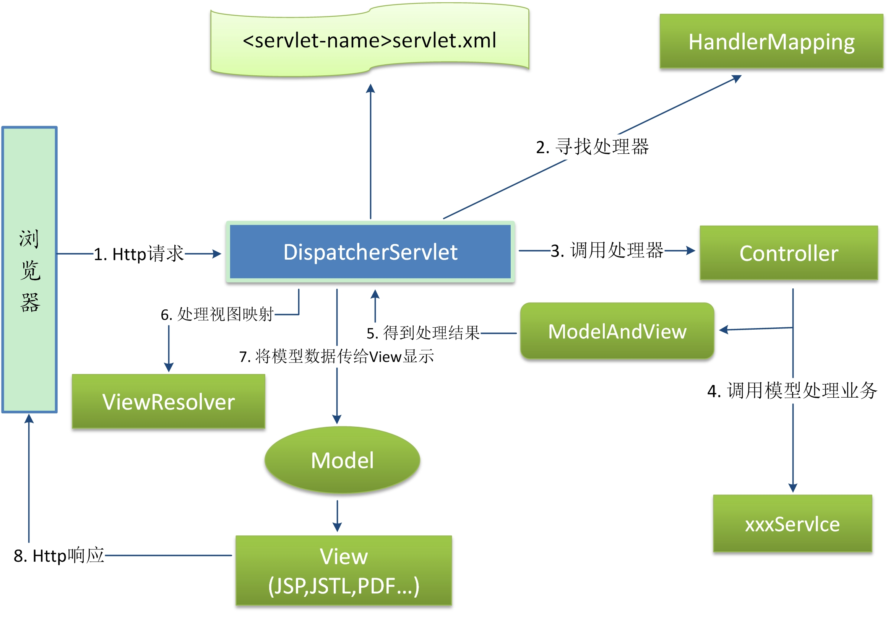

## Spring mvc的处理过程
首先看下图处理流程。

1、DispatcherServlet接收前台的请求。DispatcherServlet可以配置多个，用于处理不同的url路径。

> 这些dispatcherServlet需要配置在web.xml文件中。这个Servlet不是实际的一个java类。
它以一个xml配置文件的形式展现，提供各种请求处理的功能。以及后台处理完后的视图解析。还有一些重要的配置：包的扫描、上传文件参数配置。

2、DispatcherServlet收到请求之后将寻找处理器进行处理，传统的老的Spring版本采用xml文件配置这些handlerMapping.
每次新增开发都需要配置到xml，耦合度高，这里使用注解进行handler的注册，让对应的请求路径能映射到对应的controller里的某个方法。

3、怎么将Service层以注解的形式注入到Controller层。避免xml配置。

4、视图解析能解析成什么种类的页面：jsp、html？模板？

5、符合注解的持久层怎么生成？

6、Spring包之间的关系，各个包有什么各自的用。

7、maven的xml应该怎么配置？